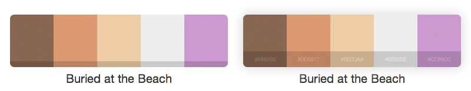

# jquery.swatches

This is a jQuery plugin that turns a single `div` into a sweet color swatch (aka, color pallette).

## Usage

Simply place a similar `div` element where ever you want a swatch to appear:

    

Then, after including `jquery.swatches.js`, call the `swatchify()` function on the `div`:

    $('.swatch').swatchify();

And when you load your page, you'll have this lovely thing staring at you:

## Customizing

The `div` can have any class you want, however the stylesheet supplied is only configured for the `.swatch` class. Using different classes would allow you to render groups of swatches at individual times by calling `swatchify()` on a different selector.

Two strings of data need to be provided by the `div`: `data-name` and `data-colors`. The name must be a string representing the name of the swatch. The `data` string is a comma-seperate list of hex color codes. The list can be as long as you want, each color code will be used to create a portion of the swatch.

## Examples

For more examples, check out [the examples website](http://maxmackie.com/swatches)

## Contributing

I'm open to any kind of contribution. If you don't have time to submit a pull request, open an issue for a new feature or enhancement and I'll get to it when I have time (or someone else will).

## License

Swatches is released under the MIT license, which is included in the plugin itself.

